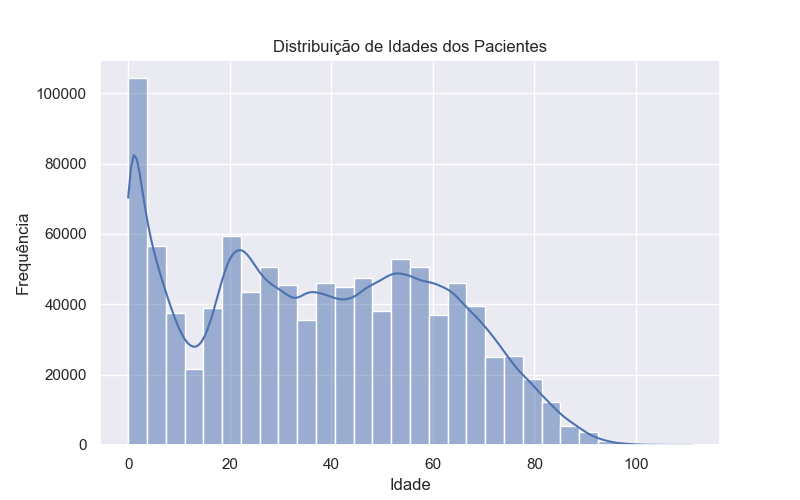
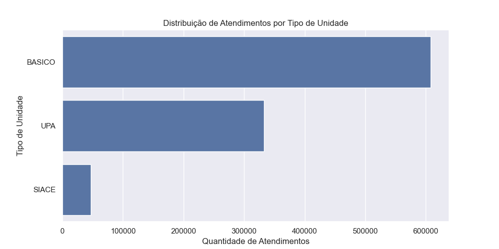
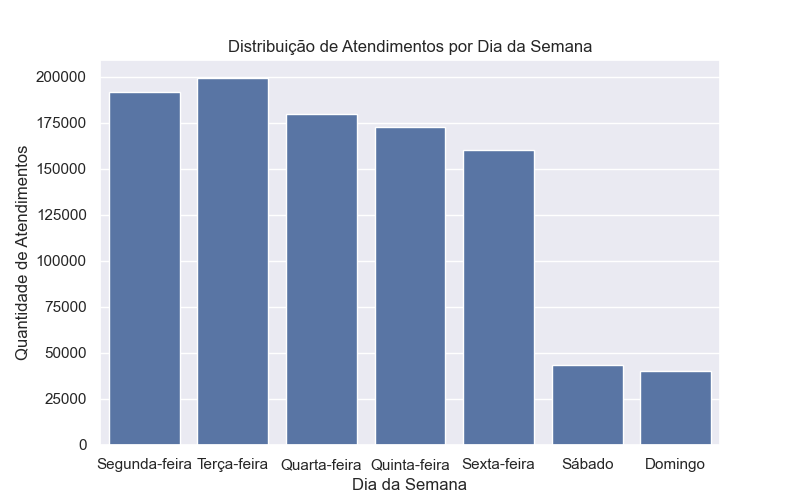
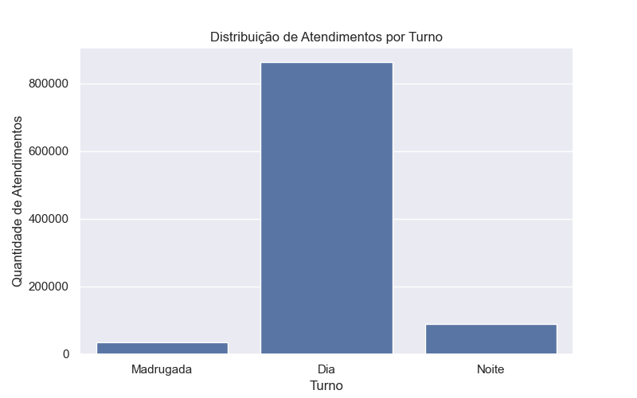
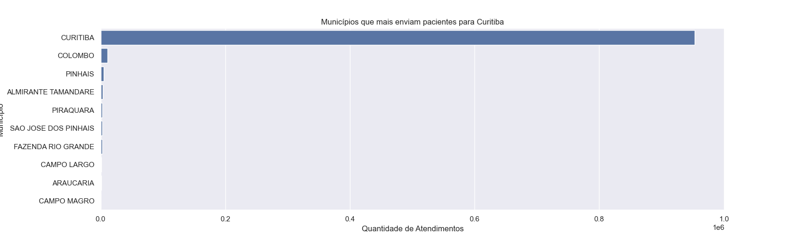
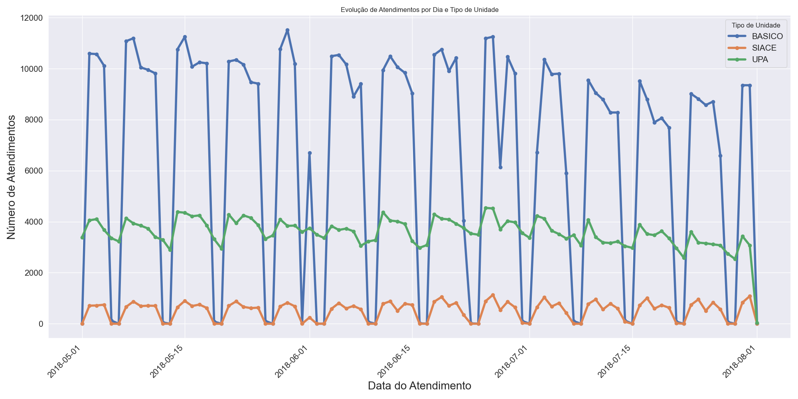
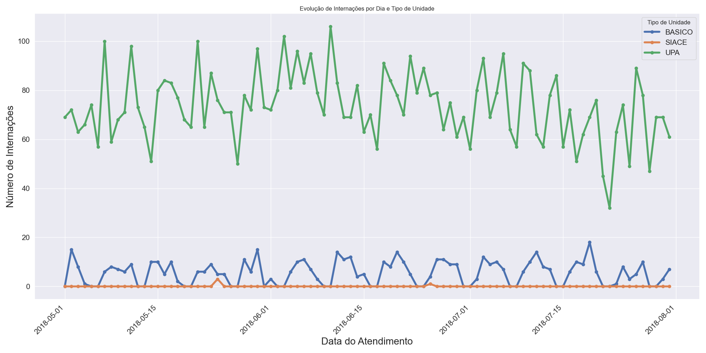
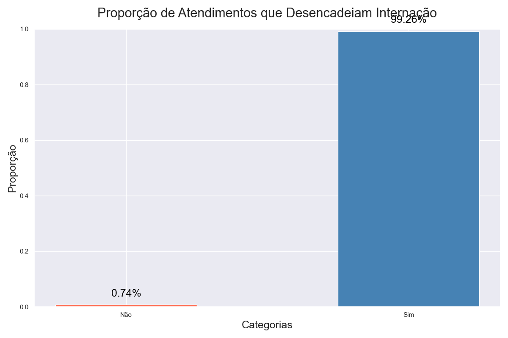
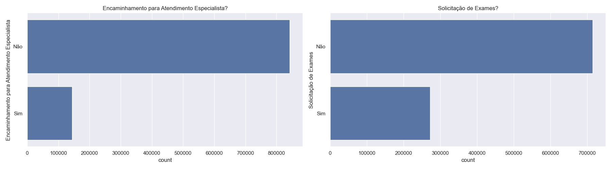

# Documentação do Projeto: Análise de Atendimentos nas Unidades Municipais de Saúde de Curitiba

## Introdução

Este projeto tem como objetivo explorar as etapas do processo de análise de dados, incluindo perguntar, preparar, processar, analisar, compartilhar e agir, através de uma análise exploratória e visualização dos dados dos atendimentos médicos nas Unidades Municipais de Saúde de Curitiba, com base em um dataset disponibilizado pela plataforma E-Saúde.

## Cenário

Como analista de dados júnior, você foi encarregado de liderar um projeto de Análise Exploratória de Dados (EDA) sobre os atendimentos médicos em Curitiba. Seu objetivo é realizar uma análise para identificar padrões, tendências e possíveis inconsistências nos dados. Você utilizará o conjunto de dados da plataforma E-Saúde e executará as seguintes etapas:

1. **Entendimento Geral dos Dados**: Inspeção inicial, verificação da estrutura e formatação.

2. **Tratamento de Dados**: Conversão de formatos e cálculos como a idade dos pacientes.

3. **Análise Estatística Descritiva**: Estatísticas básicas como média e desvio padrão.

4. **Visualizações Gráficas**: Histogramas, gráficos de barras e análise temporal.

5. **Extração de Subconjuntos**: Filtragem e segmentação de dados para análises específicas.

Após essas etapas, serão gerados insights para possíveis ações a partir dos resultados obtidos.

## ChangeLog

- **10/11/2016** – Lançamento da versão inicial.

- **08/09/2018** – Atualização do conjunto de dados e pequenas melhorias.

---

## Importação, Limpeza dos Dados e Feature Engineering

### 1. Importação do Dataset

```python

import pandas as pd

import matplotlib.pyplot as plt

import seaborn as sns

# Formatação de 2 casas decimais

pd.options.display.float_format = '{:,.2f}'.format

# Para mostrar todas as colunas ao usar o método head()

pd.set_option('display.max_columns', 100)

sns.set()

# Importando o Arquivo

caminho_arquivo = "data/2018-08-13_Sistema_E-Saude_Medicos_-_Base_de_Dados.csv"

# Ler o arquivo CSV com encoding corrigido

df = pd.read_csv(caminho_arquivo, sep=";", encoding="ISO-8859-1")

```

### 2. Inspeção Inicial dos Dados

O dataset contém 987442 linhas e 37 colunas. Exibimos as primeiras linhas do dataset para uma análise preliminar.

```python

print(df.head())

print(f"{df.shape[0]} linhas e {df.shape[1]} colunas")

```

### 3. Conversão de Colunas de Data

As colunas de data foram convertidas para o formato datetime para facilitar análises temporais.

```python

df['Data do Atendimento']  = pd.to_datetime(df['Data do Atendimento'].str.strip(), errors='coerce', dayfirst=True)

df['Data de Nascimento']   = pd.to_datetime(df['Data de Nascimento'].str.strip(), errors='coerce', dayfirst=True)

df['Data do Internamento'] = pd.to_datetime(df['Data do Internamento'].str.strip(), errors='coerce', dayfirst=True)

```

### 4. Limpeza de Dados

Remoção de colunas desnecessárias e tratamento de valores ausentes.

```python

colunas_remover = [

'Código do Tipo de Unidade', 'Código da Unidade', 'Código do Procedimento',

'Descrição do Procedimento', 'Código do CBO', 'Descrição do CBO',

'Descrição do CID', 'Qtde Prescrita Farmácia Curitibana',

'Qtde Dispensada Farmácia Curitibana', 'Qtde de Medicamento Não Padronizado',

'Área de Atuação'

]

df.drop(columns=colunas_remover, inplace=True, errors='ignore')

df.dropna(subset=['Código do CID'], inplace=True)

df.rename(columns={'Município': 'Município'}, inplace=True)

```

### 5. Criação de Novas Colunas

Criação de colunas para Idade, Classificação Etária, Dia da Semana, Turno de Atendimento e Fim de Semana.

```python

df['Idade'] = (df['Data do Atendimento'] - df['Data de Nascimento']).dt.days // 365

# Classificação Etária

def classificar_idade(idade):

if idade < 12:

return 'Criança'

elif idade < 18:

return 'Adolescente'

elif idade < 60:

return 'Adulto'

else:

return 'Idoso'

df['Classificação Etária'] = df['Idade'].apply(classificar_idade)

# Análise de data

df['Dia da Semana'] = df['Data do Atendimento'].dt.day_name()

# Função para determinar o turno do atendimento

def turno_do_atendimento(hora):

if hora < 6:

return 'Madrugada'

elif hora < 19:

return 'Dia'

else:

return 'Noite'

df['Turno do Atendimento'] = df['Data do Atendimento'].dt.hour.apply(turno_do_atendimento)

df['Fim de Semana'] = df['Dia da Semana'].isin(['Saturday', 'Sunday'])

```

---

## Análise Exploratória de Dados (EDA)

### 1. Estatísticas Gerais

Foram gerados resumos estatísticos das variáveis numéricas e categóricas, armazenados em um arquivo CSV para futura análise.

- [Estatísticas Gerais (CSV)](estatisticas_gerais.csv)  


### 2. Distribuição de Idades

A distribuição de idades dos pacientes foi visualizada para entender as faixas etárias que mais utilizam os serviços de saúde.



### 3. Distribuição de Atendimentos por Tipo de Unidade

A quantidade de atendimentos por tipo de unidade foi analisada, identificando quais unidades recebem maior demanda.



### 4. Análise de Atendimentos por Dia da Semana

O comportamento dos atendimentos ao longo da semana foi explorado para verificar padrões sazonais.



### 5. Turno dos Atendimentos

A análise do turno dos atendimentos ajudou a identificar os horários de maior movimento nas unidades.



### 6. Análise de Demandas de Outras Cidades

Verificou-se a demanda de municípios fora de Curitiba para os atendimentos médicos.



### 7. Análise de Atendimentos por Data e Tipo de Unidade

Podemos agrupar os dados por dia de atendimento e tipo de unidade, somando o número de atendimentos.

 

### 8. Análise de Internações por Data e Tipo de Unidade

Se a informação de internação estiver disponível no dataset, podemos usar um campo que indique se o paciente foi internado ou não. Vamos agrupar novamente por dia e tipo de unidade, somando as internações.

 

### 9. Proporção de Internações

A análise revelou que menos de 1% dos atendimentos resultam em internação, o que é um fator relevante em análises de desbalanceamento de dados.

 

### 10. Encaminhamentos para Especialistas e Solicitações de Exames

A proporção de atendimentos encaminhados para especialistas e com solicitação de exames também foi analisada.

 

---

## Considerações Finais

Após a execução da Análise Exploratória de Dados, foram identificados padrões relevantes, como as faixas etárias mais comuns entre os pacientes, os tipos de unidades mais procurados, a distribuição de atendimentos ao longo da semana e a demanda de pacientes de outras cidades.

## Próximos Passos

- Tratar os dados desbalanceados (internações e outros fatores).

- Realizar modelagem preditiva para prever variáveis como internação e encaminhamentos para especialistas.

- Explorar outras análises mais detalhadas, incluindo dados de localização e características do paciente.

---
